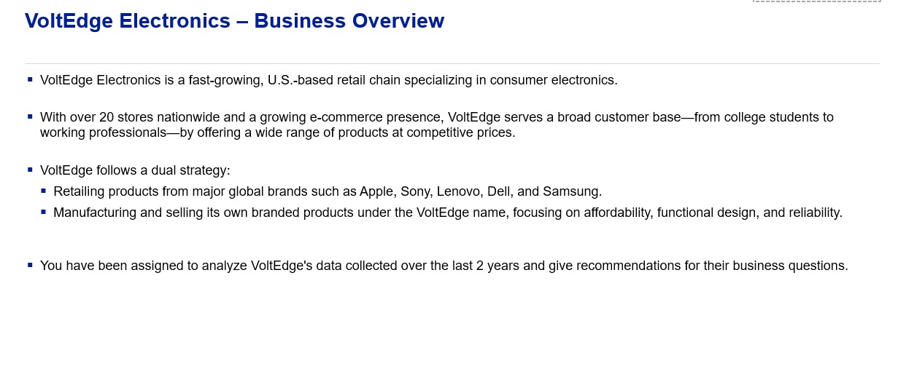

# VoltEdge-data-analysis

Here below is information about VoltEdge

## Case Study Questions

1. Data Pre-Processing

Using the provided Excel data, mention the data columns and identify the keys (primary, secondary, foreign).

What sanity checks did you apply before starting analysis?

Are there any incorrect data formats or entries? Any inactive stores in sales data?

Enlist the preprocessing and refinement steps, with key observations/assumptions.

2. National Business Performance Overview

Populate revenue and profit tables and create visualizations (e.g., line charts).

Comment on trends (YoY and QoQ).

Identify top 3 cities by revenue.

Mention hypotheses for the observed trends.

3. Brand and Product Category Performance

How are VoltEdge products performing compared to other brands?

Populate profit tables for each product category.

Share insights on top performers and struggling brands/categories.

4. Subcategory Deep Dives

Analyze subcategories using revenue share and profit scatter plots.

Interpret the graph and give actionable insights for store managers.

5.1 Store Performance Review – Individual Stores

Evaluate store-level performance using growth, profit, and market share data.

Identify top and bottom performers.

5.2 Store Performance Review – Weighted Ranking

Rank stores based on weighted score of four metrics:

2024 Revenue (20%)

YoY Revenue Growth (10%)

Market Share Delta (40%)

2024 Profit (30%)

Recommend which store should be closed down based on performance and cost.

6. Customer Demographics & Loyalty

Calculate average age and gender split across customer segments.

Identify loyal customers (visits > 4 & MTBO < 2.5 months).

Find top 3 product subcategories in the High segment.

Report VoltEdge brand penetration by customer segment.

7. Customer & Store Segmentation

Create a cross-tab of customer vs. store segment counts.

Identify top 3 stores with the highest loyalty rates.

